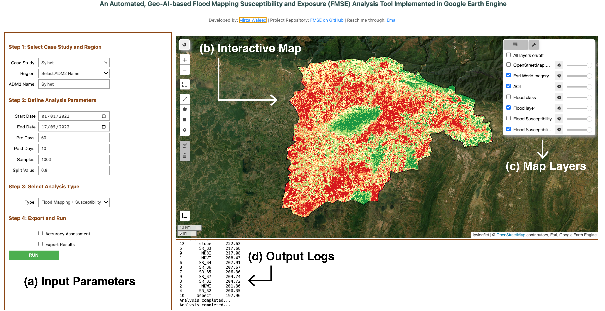

# An Automated Geo-AI based Flood Mapping, Susceptibility and Exposure (FMSE) Analysis Tool Implemented in Google Earth Engine

## The paper is currently uder review. The code will be made available upon acceptance of the paper.

If you are interested in this work, please contact me at:

- Email: [waleedgeo at outlook dot com](mailto:waleedgeo@outlook.com)

- LinkedIn: [Mirza Waleed](https://www.linkedin.com/in/waleedgeo)

- Portfolio: [Waleedgeo.com](https://waleedgeo.com)